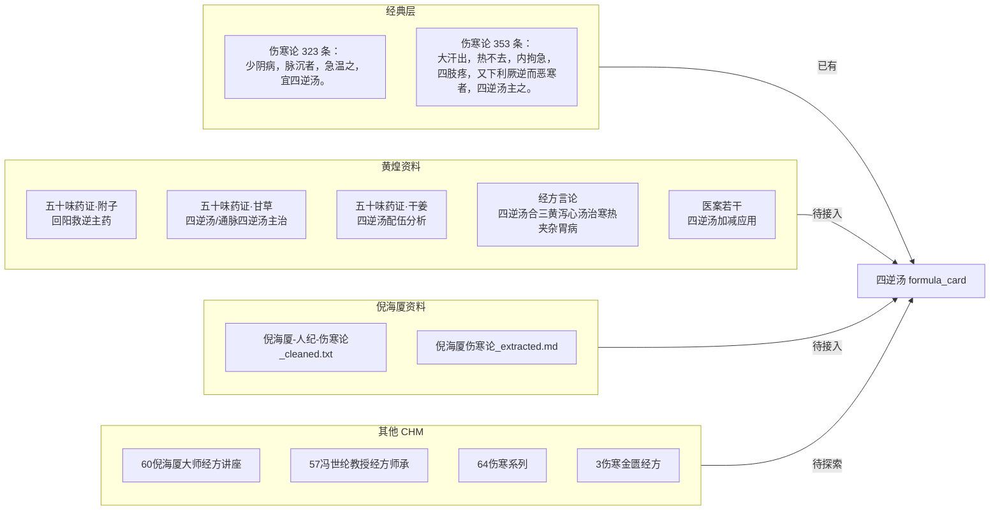
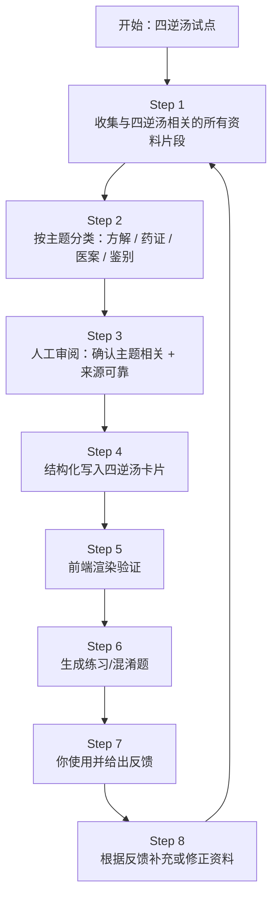

# 四逆汤试点方案

> **版本**：v1.0  
> **日期**：2026-06-14  
> **状态**：待确认后执行  
> **本档定位**：用一个具体方剂跑通“资料 → 卡片 → 前端 → 反馈 → 迭代”的最小闭环。

---

## 一、为什么选四逆汤

| 理由 | 说明 |
|---|---|
| **代表性强** | 少阴病主方，回阳救逆，是《伤寒论》核心方之一。 |
| **资料丰富** | 黄煌五十味药证（附子/甘草/干姜）、黄煌言论、黄煌医案、倪海厦讲解均有涉及。 |
| **现有基础好** | `data/formula_cards.json` 已有四逆汤卡片，`data/source_cards.json` 已有相关条文。 |
| **层次完整** | 可同时验证：药证层 → 方剂层 → 经验层 → 练习层。 |
| **边界清晰** | 四逆汤 vs 通脉四逆汤 vs 四逆散 vs 当归四逆汤，容易出混淆题，便于验证练习生成。 |

---

## 二、四逆汤资料地图

---

## 三、迭代流程

---

## 四、每步具体产出

### Step 1：收集资料片段

**目标**：把项目内所有与“四逆汤”相关的文本片段找出来。

**来源**：
- `extracted/黄煌教授经方沙龙/cleaned/五十味药证/附子.md`
- `extracted/黄煌教授经方沙龙/cleaned/五十味药证/甘草.md`
- `extracted/黄煌教授经方沙龙/cleaned/五十味药证/干姜.md`
- `extracted/黄煌教授经方沙龙/cleaned/经方言论/黄煌经方言论整理版_十分实用.md`
- `extracted/黄煌教授经方沙龙/cleaned/医案/` 中含四逆汤的相关医案
- `extracted/annotations/倪海厦-人纪-伤寒论_cleaned.txt`
- `extracted/annotations/倪海厦伤寒论_extracted.md`
- `raw/extracted-chm/60倪海厦大师经方讲座/`（如含四逆汤）

**产出**：
- `extracted/pilot_si_ni_tang/raw_segments.md`：原始片段汇总，标注来源。

### Step 2：主题分类

**目标**：把片段按用途分类，决定挂到哪里。

| 类别 | 用途 | 落点 |
|---|---|---|
| 方解/主治 | 解释四逆汤为什么这样组方 | `formula_card.canonical.core_rationale` 或 `references` |
| 药证 | 附子/干姜/甘草在四逆汤中的作用 | `references`（药证资料） |
| 医案 | 四逆汤临床应用 | `experience_cards.json` + `formula_card.experience_ids` |
| 鉴别 | 四逆汤 vs 通脉四逆汤 vs 四逆散 | 练习干扰项 / `references` |

**产出**：
- `extracted/pilot_si_ni_tang/classified_segments.md`

### Step 3：人工审阅

**目标**：确认每一片段是否值得入库。

**审阅标准**：
- 是否确实讲四逆汤？（不是四逆散/当归四逆汤）
- 作者是否可靠？（黄煌/倪海厦/冯世纶/胡希恕等）
- 是否有临床价值？（剂量、加减、适应症、医案）

**产出**：
- 审阅标记：`approve` / `reject` / `待定`

### Step 4：结构化写入卡片

**目标**：把审阅通过的内容写入 `data/formula_cards.json` 和 `data/experience_cards.json`。

**修改字段**：
- `formula_card.data.canonical.references`：新增药证、方解、鉴别类 references。
- `formula_card.experience_ids`：关联审阅通过的四逆汤医案。
- `experience_cards.json`：新增 1–3 张四逆汤医案经验卡。

**产出**：
- 更新后的 `data/formula_cards.json`
- 更新后的 `data/experience_cards.json`
- 备份到 `data/archive/`

### Step 5：前端渲染验证

**目标**：打开 `app/index.html`，确认四逆汤卡片页：
- 参考资料区正确显示新增 references。
- 经验卡区正确显示医案（需先修复 `getExperience(id)` bug）。

### Step 6：生成练习/混淆题

**目标**：基于新增资料生成新题目。

**可生成题目**：
- `1→0`：症状 → 四逆汤
- `2→0`：药物组合 → 四逆汤
- `case` 类：给出医案片段，选最适方（四逆汤 vs 通脉四逆汤 vs 四逆散）

### Step 7：你使用并反馈

**目标**：你实际做题/学习，告诉我：
- 参考资料有没有帮助？
- 题目质量如何？
- 有没有觉得缺什么？

### Step 8：根据反馈迭代

**目标**：针对反馈补充资料。

**示例**：
- 如果“四逆汤与通脉四逆汤鉴别”题错误率高 → 补充黄煌/倪海厦关于两者鉴别的讲解。
- 如果医案经验卡太少 → 再去 57 冯世纶资料中找四逆汤医案。

---

## 五、验收标准

| 检查项 | 标准 |
|---|---|
| 资料收集 | 至少收集 8–10 个与四逆汤直接相关的片段 |
| 审阅通过 | 至少 5 个片段通过审阅 |
| 卡片更新 | 四逆汤 formula_card 新增 ≥3 条 references，≥1 条 experience |
| 前端渲染 | 参考资料区和经验卡区正常显示，无报错 |
| 练习生成 | 至少生成 3 道新题，人工抽检无错误 |
| 飞轮闭环 | 你给出至少 1 条反馈，并根据反馈完成 1 轮补充 |

---

## 六、需要你先确认的三个点

1. **范围**：只做项目内已有资料（黄煌 + 倪海厦），还是同时清洗 60/57/64/3 中四逆汤相关内容？
   - 建议：先只做黄煌 + 倪海厦，跑通闭环后再扩展到其他 CHM。

2. **深度**：
   - 轻量：只挂 `references` 链接/摘要。
   - 重量：同时生成 `experience_card` 和练习题目。
   - 建议：重量，才能真正验证飞轮。

3. **审阅方式**：
   - 方案 A：我把收集到的片段列出来，你逐条 approve/reject。
   - 方案 B：我先按规则初筛，只把高置信度的给你确认。
   - 建议：方案 B，节省你的时间。

---

## 七、我理解的“用四逆汤迭代”

> 不是 abstract 地讨论 schema 或流程，而是**以四逆汤为切入口**，把所有相关原始资料聚起来，经过清洗/分类/审阅/入库/前端展示/出题/使用反馈，跑出一个**可复制的最小数据飞轮**。这个飞轮跑通后，其他方（桂枝汤、大柴胡汤、茯苓四逆汤等）就可以按同一套流程批量复制。

如果理解正确，我们就从 **Step 1 收集资料片段** 开始。
