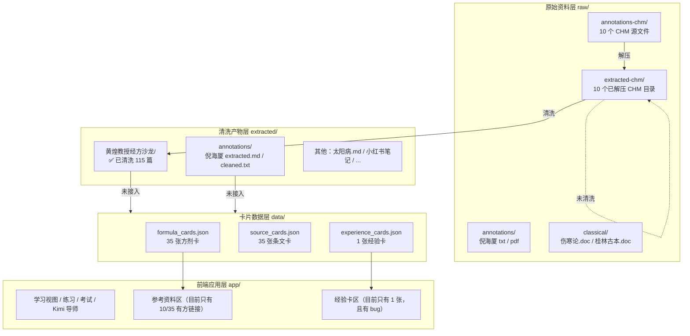
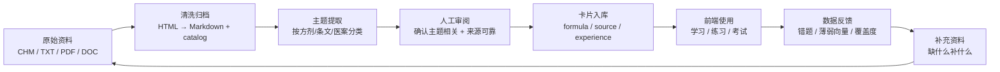
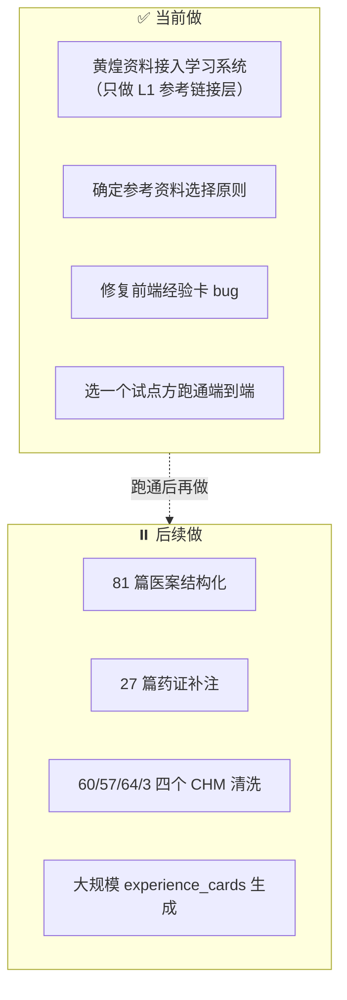
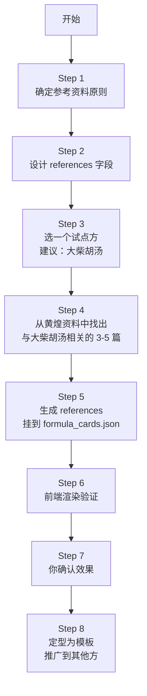

# 当前任务对齐图

> 本页用流程图形式梳理：**我们现在在哪里、要往哪里去、下一步先做什么**。  
> 如果你发现图和实际想法不一致，请直接指出来，我们就在这里对齐。

---

## 图 1：现状 —— 我们手头有什么

**现状一句话**：原始资料很多，黄煌 CHM 已清洗但未接入系统，其他 CHM 还未清洗，卡片数据的经验层几乎空白。

---

## 图 2：目标 —— 我们要建立的数据飞轮

**目标一句话**：让每一份原始资料都能经过“清洗 → 提取 → 审阅 → 入库 → 使用 → 反馈 → 再补充”的闭环，持续转动。

---

## 图 3：边界 —— 当前这轮不做的事

**边界一句话**：当前不碰大规模清洗和医案结构化，先把“参考资料怎么挂、挂什么、挂完前端长什么样”跑通。

---

## 图 4：下一步路径 —— 我建议这样走

---

## 我们现在要回答的三个关键问题

| 问题 | 为什么重要 | 当前状态 |
|---|---|---|
| **参考资料挂什么？** | 决定前端“参考资料区”显示什么内容 | 原则初稿已写，待你确认 |
| **参考资料怎么挂？** | 决定 `references` 字段结构和入库方式 | 需要设计 schema |
| **挂完怎么验证？** | 决定这套流程能不能推广 | 需要选一个试点方跑通 |

---

## 我用一句话总结

> **当前核心任务：把黄煌资料中“主题相关、来源可靠”的内容，以结构化的 references 形式挂到现有方剂卡上，前端能正确显示，并且这个过程能复制到其他方。**

如果这句话和你想的不一样，请直接改。
