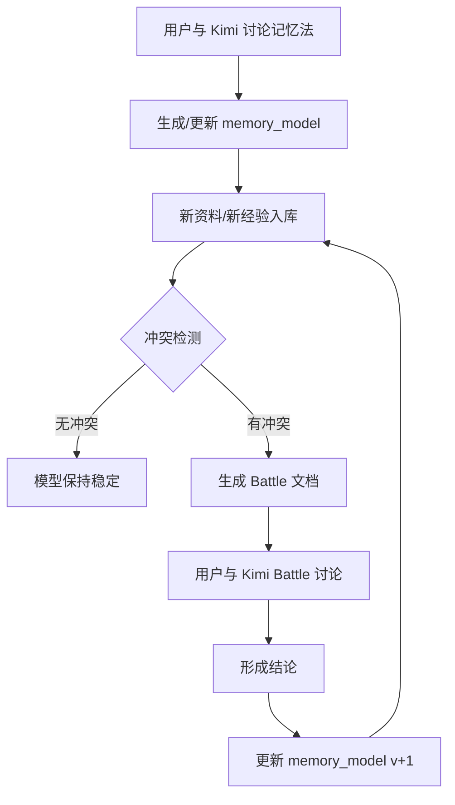

# 方剂记忆模型与 Battle 机制设计

> **版本**：v0.1（草案）  
> **日期**：2026-06-14  
> **状态**：待评审  
> **本档定位**：把“用户与 Kimi 讨论如何记方子”的过程结构化、可审计、可迭代。

---

## 一、为什么需要这个机制

当前系统已经能：

- 收集资料 → 审阅 → 挂 references / experience_cards → 前端展示 → 出题

但还缺少一层：**用户自己怎么“理解并记住”这个方子**。

人在学经方时，大脑会做三件事：

1. **压缩**：把大量症状、药证、医案压缩成几条记忆线索。
2. **建模**：形成“出现 A + B + C 就选这个方”的判断模型。
3. **迁移**：把这个模型套到别的方子上。

如果能让 Kimi 把这套东西显式记录下来，并且**持续用新资料去挑战它**，就能形成：

> 个人记忆模型 → 新资料/新案例 → 冲突检测 → Battle → 模型更新

这就是“battle”机制的核心。

---

## 二、核心概念

### 2.1 记忆模型（Memory Model）

每个方剂对应一份用户当前的“记忆法”文本 + 结构化规则。它不是方剂卡片的替代，而是**用户视角的压缩版本**。

关键字段：

| 字段 | 说明 |
|---|---|
| `formula_id` | 关联的方剂卡片 ID |
| `memory_hook` | 一句话钩子，比如“回阳救逆第一方” |
| `key_cues` | 用户用来识别此方的一组关键线索 |
| `analogies` | 类比/意象，帮助记忆 |
| `distinguishing_rules` | 与类方鉴别的判断规则 |
| `confidence` | 用户对当前模型的置信度：高 / 中 / 低 |
| `version` | 模型版本，每经一次 battle +1 |
| `source_discussions` | 产生该模型的对话/资料来源 |

### 2.2 冲突（Conflict）

当新入库的参考资料、经验卡或用户新输入的观点，**与用户当前记忆模型中的判断规则相矛盾**，即触发冲突。

冲突分两级：

- **Level 1 · 边界冲突**：新资料扩展了模型的适用范围，但没说原模型错。
  - 例：模型认为“四逆汤主四肢厥冷”，新资料说“霍乱上吐下泻也用四逆汤”→ 模型需要补充“急症回阳”这一层。
- **Level 2 · 核心冲突**：新资料直接挑战模型的核心判断规则。
  - 例：模型认为“四逆汤必须脉沉微”，新资料说“脉浮大但里寒外热者用通脉四逆汤”→ 需要重新审视“脉”这一线索的权重。

### 2.3 Battle

冲突触发后，Kimi 不直接修改模型，而是生成一份 **Battle 记录**，抛出两个必答题：

1. 如果我的思路是对的，为什么没办法解释当前的问题？
2. 我是否需要去更新、优化我的模型？

用户与 Kimi 讨论后，形成结论，再写回 `memory_models.json`。

---

## 三、数据 Schema

### 3.1 `data/memory_models.json`

```json
[
  {
    "id": "si-ni-tang",
    "formula_id": "si-ni-tang",
    "formula_name": "四逆汤",
    "memory_hook": "少阴阳衰、阴寒内盛时的回阳急救开关",
    "key_cues": [
      "脉沉微",
      "四肢厥冷",
      "下利清谷",
      "但欲寐",
      "恶寒蜷卧"
    ],
    "analogies": [
      "阳气欲脱时重启心肾阳气的电源键"
    ],
    "distinguishing_rules": [
      "四肢厥冷 + 下利清谷 + 脉沉微 → 四逆汤",
      "里寒外热、汗出而厥、脉微欲绝 → 通脉四逆汤",
      "大吐大下后烦躁、胃停水 → 茯苓四逆汤",
      "心理因素导致手足冷而不痛 → 四逆散",
      "血虚受寒、手足冷且痛 → 当归四逆汤"
    ],
    "confidence": "中",
    "version": 1,
    "source_discussions": [
      {
        "discussion_id": "si-ni-tang-disc-001",
        "title": "四逆汤第一印象整理",
        "date": "2026-06-14Txx:xx:xx"
      }
    ],
    "created_at": "2026-06-14Txx:xx:xx",
    "updated_at": "2026-06-14Txx:xx:xx"
  }
]
```

### 3.2 `docs/battles/{formula_id}-battle-{NNN}.md`

```markdown
# Battle：四逆汤 · 第 1 轮

## 触发时间
2026-06-14

## 触发来源
- 新入库 reference：`si-ni-tang-ref-002` 黄煌论四逆汤常用配方与加减
- 新入库 experience：`si-ni-tang_exp-001` 误下后下利清谷救里案

## 用户当前模型（v1）
- 核心钩子：回阳救逆第一方
- 关键线索：脉沉微、四肢厥冷、下利清谷
- 鉴别规则：...

## 冲突点
1. 模型强调“脉沉微”，但经验卡中患者“脉反沉”后即用四逆汤，似乎“脉沉”即可，不一定到“微”。
2. 模型未覆盖“误治后”这一典型使用场景。

## Battle 问题
1. 如果我的思路是对的，为什么没办法解释“误汗/误下后里虚寒用四逆汤”这个场景？
2. 我是否需要去更新、优化我的模型？

## 讨论记录
（用户与 Kimi 的对话原文）

## 结论
- 更新 `key_cues`：增加“误治后里阳大虚”场景。
- 更新 `distinguishing_rules`：将“脉沉微”放宽为“脉沉/沉微”作为核心线索之一。
- 版本升至 v2。
```

---

## 四、工作流程



### 4.1 触发冲突检测的时机

- 新增 references / experience_cards 后
- 用户主动输入“我觉得这个方子应该这样记”后
- 用户做完题、发现错题后

### 4.2 冲突检测 Prompt（Kimi 内部使用）

```text
你是一名经方学习助手。请基于以下信息检测冲突：

【用户当前记忆模型】
{memory_model_json}

【新增资料摘要】
{new_reference_or_experience_summary}

请判断：
1. 新增资料是否与记忆模型存在冲突？
2. 冲突等级：Level 1（边界扩展）还是 Level 2（核心挑战）？
3. 如果冲突，请用两句话描述冲突点，并提出上述两个 Battle 问题。
```

---

## 五、与现有系统的集成

### 5.1 与数据飞轮的关系

```text
资料收集 → 审阅 → 入库 → 前端展示 → 出题 → 用户反馈 → 资料补充
                ↓
         触发冲突检测
                ↓
         Battle → 更新 memory_model
                ↓
         反哺出题/资料补充策略
```

### 5.2 与前端的关系

学习视图（learn view）中新增一个 tab 或折叠区：

- **我的记忆法**：展示当前 memory_model
- **与 Kimi 讨论**：输入框，用户输入自己的理解，Kimi 整理成文本
- **Battle 记录**：列出历史 battle 文档链接

### 5.3 与练习系统的关系

- 出题时可以把 `distinguishing_rules` 作为干扰项来源。
- 用户答错后，可以提示：“你的记忆模型中认为 X，但这道题涉及 Y，是否开启 battle？”

---

## 六、四逆汤试点计划

1. **Step 1**：用户向 Kimi 描述“我现在怎么记四逆汤”。
2. **Step 2**：Kimi 整理为 `data/memory_models.json` 中第一条记录（v1）。
3. **Step 3**：用已入库的 8 条 references + 2 条 experiences 做第一轮冲突检测。
4. **Step 4**：如有冲突，生成 `docs/battles/si-ni-tang-battle-001.md`，开启 battle。
5. **Step 5**：讨论后更新 memory_model 至 v2，并写回 JSON。
6. **Step 6**：把 battle 结论同步到 references / experience_cards 的标注中（可选）。

---

## 七、待确认问题

1. `memory_models.json` 是放在 `data/` 还是 `docs/`？
   - 建议 `data/`，因为它是结构化真相源；`docs/battles/` 放讨论过程。
2. 冲突检测是自动触发还是用户手动触发？
   - 建议入库后自动检测，但只把 Level 2 冲突推给用户；Level 1 作为提示收起。
3. Battle 记录是 markdown 还是 json？
   - 建议 markdown，便于人工阅读和后续 LLM 复盘。
4. 是否需要一个全局的“个人方法论”卡片，跨方子复用？
   - 建议二期再做；一期先做 per-formula 的记忆模型。

---

## 八、下一步行动

请评审本设计。如无大问题，即可在四逆汤上跑第一例：

> **请你用你自己的话，告诉我你现在怎么记“四逆汤”**——
> 你看到哪些症状会第一时间想到它？
> 你怎么区分它和通脉四逆汤、茯苓四逆汤、四逆散、当归四逆汤？
> 有没有一个类比或画面，能帮你一下子抓住它？
